# PI-DS-OO: Projeto Integrador de Desenvolvimento de Sistemas Orientado a Objetos

## 📄 Descrição do Projeto

Este repositório contém as entregas do Projeto Integrador da disciplina de Desenvolvimento de Sistemas Orientado a Objetos (DS-OO), que teve como objetivo a modelagem e prototipação de um sistema de gestão universitária. O projeto foi desenvolvido com base na Linguagem Unificada de Modelagem (UML) e conceitos de Orientação a Objetos.

### Equipe
- Ighor Gabriel Constantino de Lima
- Luiz Fernando de Castro
---

## 🚀 Primeira Entrega: Modelagem do Sistema

Nesta fase, a equipe realizou o processo de modelagem do sistema de gestão universitária. O objetivo foi formalizar a estrutura e o comportamento do software utilizando diagramas UML, o que facilitou o entendimento e a colaboração entre os membros da equipe.

### 1. Diagrama de Caso de Uso
O diagrama abaixo representa as principais funcionalidades de cadastro do sistema, mostrando as interações do Ator "Administrador" com o sistema.

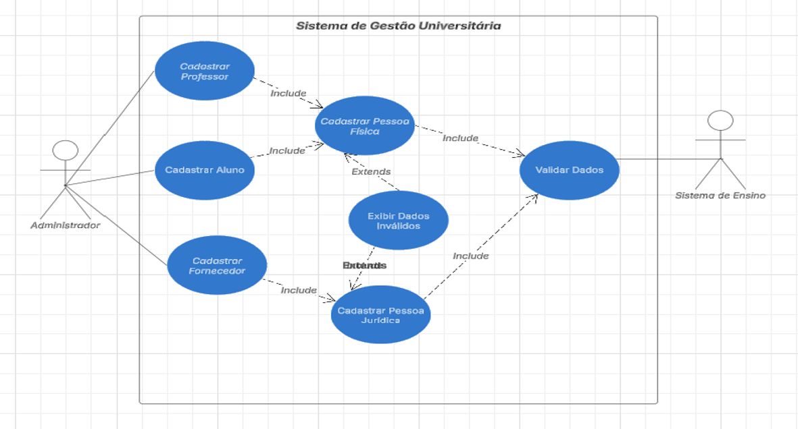 

### 2. Descrição dos Casos de Uso
Detalhes e fluxos de cada cenário de cadastro, incluindo cenários principal e alternativos, pré e pós-condições.

#### Cadastro de Pessoa Física
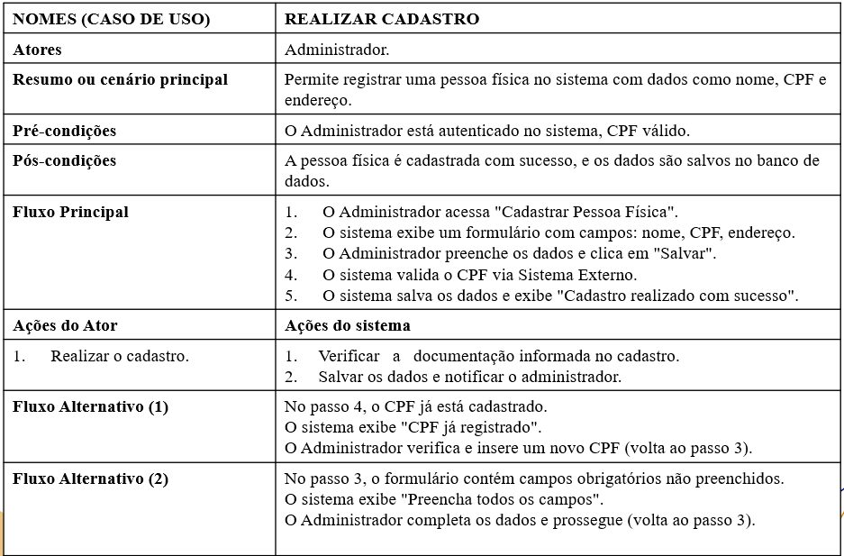

#### Cadastro de Pessoa Jurídica
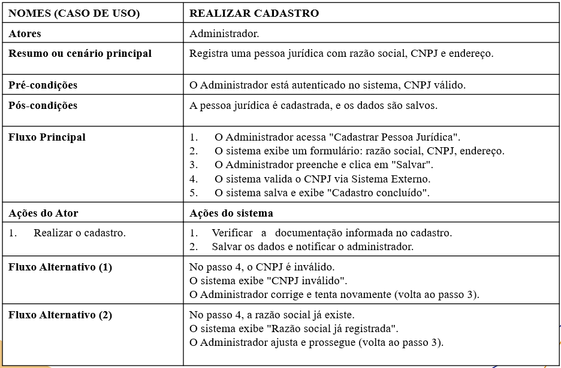

#### Cadastro de Professores
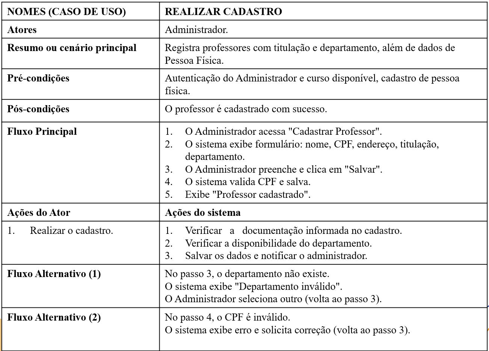

#### Cadastro de Fornecedores
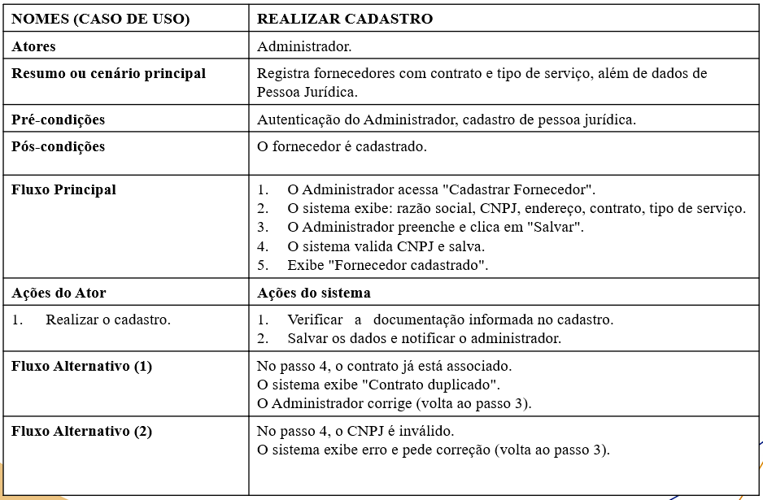

#### Cadastro de Alunos
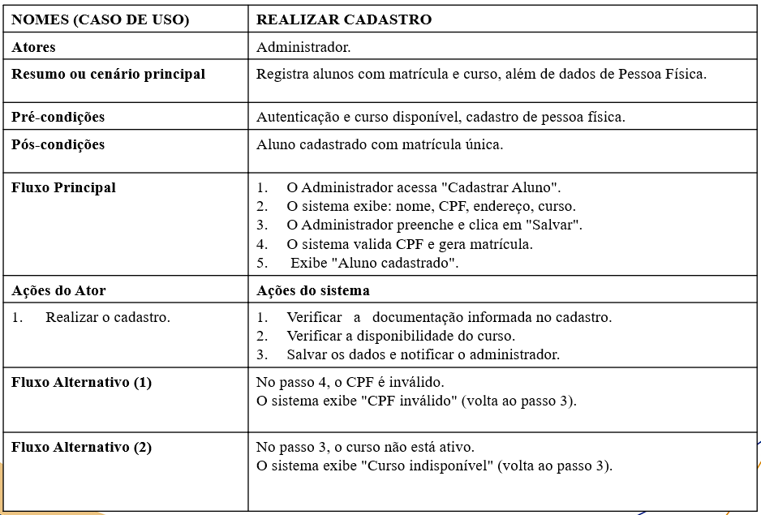

### 3. Diagrama de Classe
O diagrama de classe abaixo reflete a proposta do projeto, definindo a estrutura e as relações entre as classes (Pessoa, Pessoa Física, Pessoa Jurídica, Professor, Aluno, Fornecedor).

**[Local para colocar a imagem do seu Diagrama de Classe]**
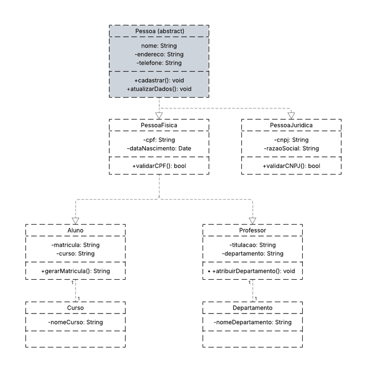

---

## ✨ Segunda Entrega: Prototipação do Sistema

A segunda fase do projeto consistiu em traduzir a modelagem UML em protótipos de interface, utilizando a ferramenta Figma. Os protótipos representam as jornadas de cadastro descritas na primeira entrega.

### Protótipos das Jornadas

Os protótipos desenvolvidos refletem o fluxo de navegação e as interações do administrador para cada cenário de cadastro.

#### Painel administrativo

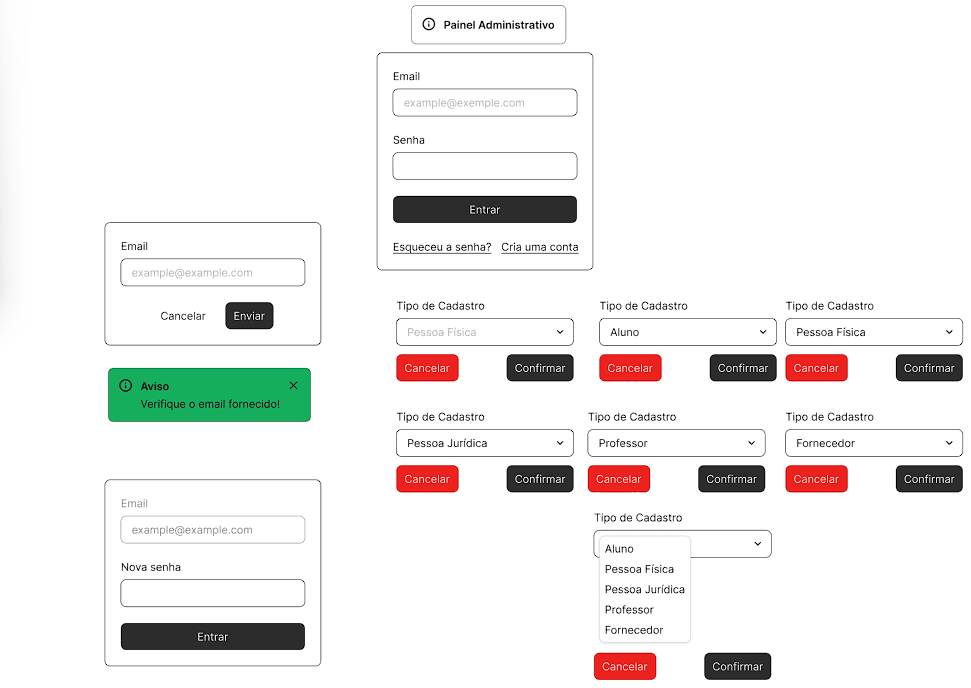

#### Cadastro de Pessoa Física

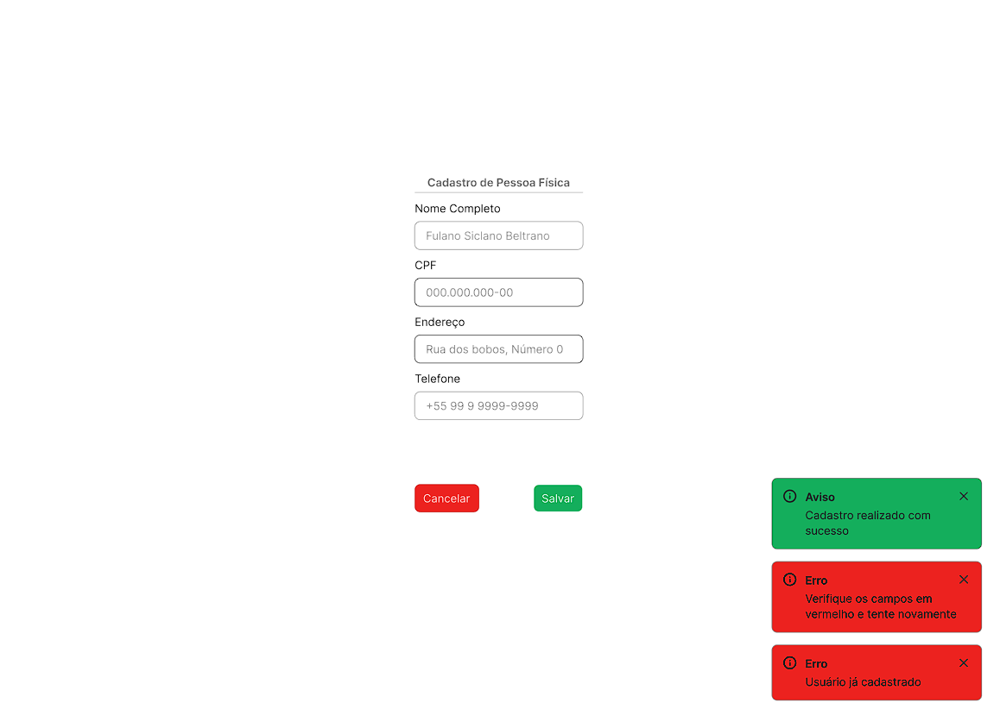

#### Cadastro de Pessoa Jurídica

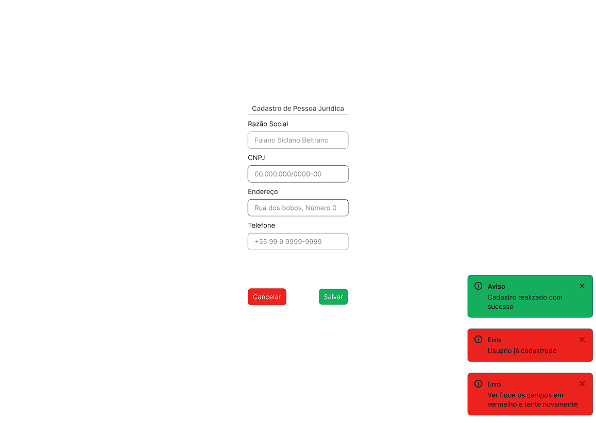

#### Cadastro de Professores

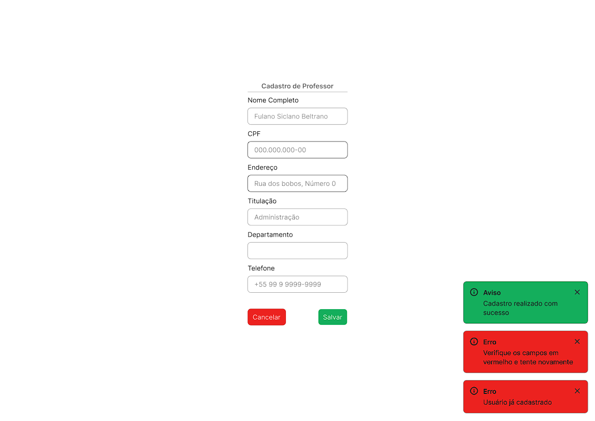

#### Cadastro de Fornecedores

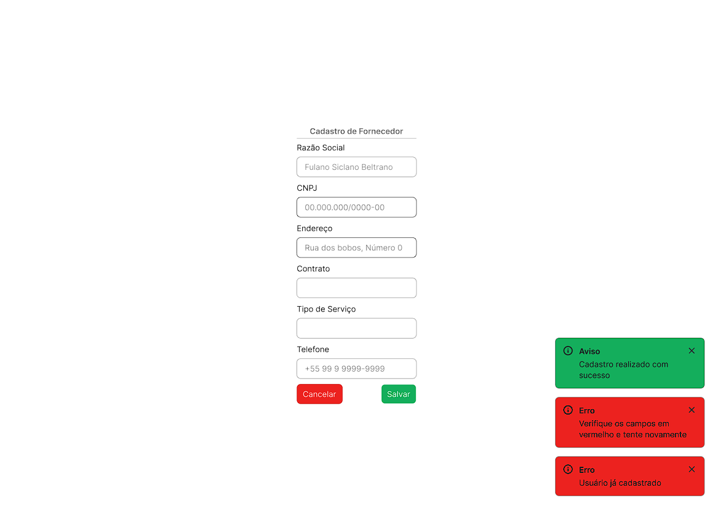

#### Cadastro de Alunos

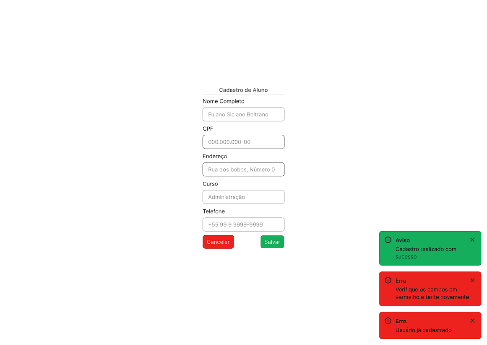

---

## 🔗 Link para o Protótipo no Figma
Você pode interagir com os protótipos funcionais diretamente no Figma através do link abaixo:

**[https://www.figma.com/proto/cDtMQRdGcyW8W2LysfB3xr/PI-DS-OO?node-id=0-1&t=Eb6Mh7IgGlcOWi01-1]**
